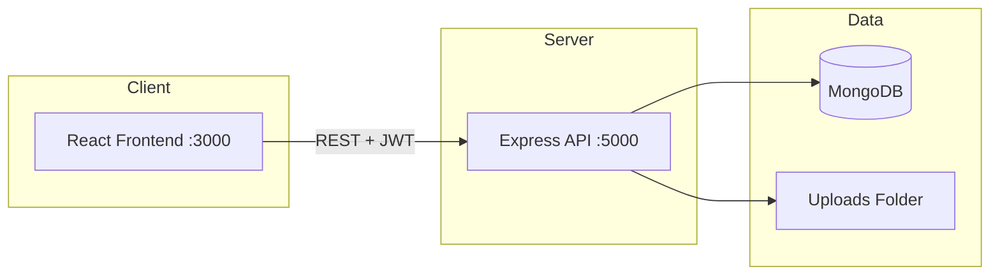

# Northstar Store

A full-stack e-commerce web application for browsing products, managing a cart and wishlist, placing orders, and administering the store through a dedicated admin panel.

**Northstar Store** pairs a React storefront with a Node.js/Express API backed by MongoDB. It is designed as a modern, responsive shopping experience with JWT authentication, role-based admin access, product ratings, and customer support messaging.

---

## Table of Contents

- [Features](#features)
- [Tech Stack](#tech-stack)
- [Project Structure](#project-structure)
- [Prerequisites](#prerequisites)
- [Getting Started](#getting-started)
- [Environment Variables](#environment-variables)
- [Default Seed Data](#default-seed-data)
- [Application Routes](#application-routes)
- [API Overview](#api-overview)
- [Running Tests](#running-tests)
- [Production Notes](#production-notes)

---

## Features

### Customer Storefront

| Feature | Description |
|---------|-------------|
| **Product catalog** | Browse, search, sort, and filter products by category |
| **Category navigation** | Shop by category from the home page; filters apply on the products page |
| **Product details** | View images, pricing, discounts, and descriptions |
| **Product ratings** | Logged-in users can rate products (1–5 stars); averages update in real time |
| **Cart** | Add/remove items, update quantities; guest cart merges on login |
| **Wishlist** | Save products for later (guest or authenticated) |
| **Checkout** | Shipping form with Cash on Delivery or card (demo) payment |
| **Order history** | View past orders when logged in |
| **Authentication** | Register and login with JWT; protected checkout and orders |
| **About & Support** | Static about page and a customer support contact form |
| **Responsive UI** | Mobile-friendly layout across all customer pages |

### Admin Panel

| Feature | Description |
|---------|-------------|
| **Dashboard** | Revenue, orders, products, and analytics overview |
| **Products CRUD** | Create, edit, and delete products with image upload or URL |
| **Categories CRUD** | Manage categories with images and descriptions |
| **Orders** | View all customer orders with expandable shipping details |
| **Customers** | List registered users with order stats |
| **Image upload** | Upload product/category images via `multer` |

---

## Tech Stack

### Frontend (`frontend/`)

- **React 18** — UI library
- **Vite** — Build tool and dev server
- **React Router** — Client-side routing
- **Framer Motion** — Page and component animations
- **React Icons** — Icon set
- **Plain CSS** — `index.css` (admin) + `styles/store.css` (storefront)

### Backend (`backend/`)

- **Node.js + Express** — REST API
- **MongoDB + Mongoose** — Database and ODM
- **JWT** — Authentication
- **bcryptjs** — Password hashing
- **Multer** — Image uploads
- **Morgan** — HTTP request logging

### Testing

- **Node.js test runner** + **Supertest** — API integration tests
- **mongodb-memory-server** — In-memory MongoDB for tests

---

## Project Structure

```
E-commerce-website/
├── backend/
│   ├── src/
│   │   ├── config/          # Database connection
│   │   ├── middleware/      # Auth, admin guard, file upload
│   │   ├── models/          # Mongoose schemas (User, Product, Order, etc.)
│   │   ├── routes/          # API route handlers
│   │   ├── utils/           # Seed script, serializers
│   │   └── server.js        # Express app entry point
│   ├── tests/               # API test suite
│   ├── uploads/             # Uploaded images (gitignored contents)
│   └── package.json
│
├── frontend/
│   ├── src/
│   │   ├── components/      # Reusable UI (Navbar, ProductCard, etc.)
│   │   ├── context/         # StoreContext, AdminContext
│   │   ├── pages/           # Route pages (Home, Products, Checkout, admin)
│   │   ├── services/        # API client
│   │   ├── styles/          # Storefront CSS
│   │   └── utils/           # Pricing helpers
│   └── package.json
│
└── README.md
```

---

## Prerequisites

Before running the project, make sure you have:

- **Node.js** v18 or later
- **npm** (comes with Node.js)
- **MongoDB** running locally or a MongoDB Atlas connection string

---

## Getting Started

### 1. Clone the repository

```bash
git clone <your-repo-url>
cd E-commerce-website
```

### 2. Start MongoDB

If using a local MongoDB instance:

```bash
# Example (depends on your OS/installation)
mongod
```

Default connection used in development: `mongodb://127.0.0.1:27017/northstar`

### 3. Set up the backend

```bash
cd backend
npm install
```

Create a `.env` file in the `backend/` folder:

```env
MONGODB_URI=mongodb://127.0.0.1:27017/northstar
JWT_SECRET=your-secure-secret-key
PORT=5000
```

Start the API server:

```bash
# Development (with auto-reload)
npm run dev

# Production
npm start
```

On first startup, the server connects to MongoDB and **automatically seeds** categories, products, a default admin user, and sample orders if the database is empty.

The API runs at: **http://localhost:5000**

Health check: `GET http://localhost:5000/api/health`

### 4. Set up the frontend

Open a new terminal:

```bash
cd frontend
npm install
npm run dev
```

The storefront runs at: **http://localhost:3000**

The frontend talks to the API at `http://localhost:5000/api` by default. To point at a different backend, create `frontend/.env`:

```env
VITE_API_URL=http://localhost:5000/api
```

### 5. Build for production (frontend)

```bash
cd frontend
npm run build
npm run preview   # optional: preview the production build locally
```

---

## Environment Variables

### Backend (`backend/.env`)

| Variable | Required | Description |
|----------|----------|-------------|
| `MONGODB_URI` | Yes | MongoDB connection string |
| `JWT_SECRET` | Yes | Secret key for signing JWT tokens |
| `PORT` | No | API port (default: `5000`) |

### Frontend (`frontend/.env`)

| Variable | Required | Description |
|----------|----------|-------------|
| `VITE_API_URL` | No | API base URL (default: `http://localhost:5000/api`) |

> **Security:** Never commit `.env` files. They are listed in `.gitignore`.

---

## Default Seed Data

When the database is empty, the seed script creates:

### Admin account

| Field | Value |
|-------|-------|
| Email | `admin@northstar.com` |
| Password | `Admin@12345` |
| Admin URL | http://localhost:3000/admin/login |

### Sample data

- **5 categories** — Electronics, Accessories, Fashion, Home, Fitness
- **6 products** — With images, prices, discounts, and stock
- **Sample orders** — For dashboard analytics

### Customer registration rules

- Email must end with `@gmail.com`
- Password must be at least **8 characters**

---

## Application Routes

### Storefront (http://localhost:3000)

| Route | Page | Auth |
|-------|------|------|
| `/` | Home | Public |
| `/products` | Product listing (search, filter, sort) | Public |
| `/products?category=Electronics` | Filtered products | Public |
| `/products/:id` | Product details + rating | Public |
| `/cart` | Shopping cart | Public |
| `/wishlist` | Wishlist | Public |
| `/checkout` | Checkout | Logged in |
| `/orders` | Order history | Logged in |
| `/order-success` | Order confirmation | Logged in |
| `/about` | About Northstar | Public |
| `/support` | Customer support form | Public |
| `/login` | Login / Register | Public |

### Admin panel

| Route | Page |
|-------|------|
| `/admin/login` | Admin login |
| `/admin` | Dashboard & analytics |
| `/admin/products` | Manage products |
| `/admin/categories` | Manage categories |
| `/admin/orders` | View all orders |
| `/admin/customers` | View customers |

---

## API Overview

Base URL: `http://localhost:5000/api`

Authenticated routes require header:

```
Authorization: Bearer <jwt_token>
```

### Public endpoints

| Method | Endpoint | Description |
|--------|----------|-------------|
| GET | `/health` | API health check |
| GET | `/products` | List all products |
| GET | `/products/:id` | Get single product |
| GET | `/categories` | List all categories |
| POST | `/auth/register` | Register customer |
| POST | `/auth/login` | Customer login |
| POST | `/auth/admin/login` | Admin login |
| POST | `/support` | Submit support message |

### Customer endpoints (auth required)

| Method | Endpoint | Description |
|--------|----------|-------------|
| GET | `/cart` | Get cart |
| POST | `/cart/add` | Add item to cart |
| PUT | `/cart/update` | Update item quantity |
| DELETE | `/cart/:id` | Remove cart item |
| GET | `/wishlist` | Get wishlist |
| POST | `/wishlist/toggle` | Add/remove wishlist item |
| GET | `/orders` | List user orders |
| GET | `/orders/:id` | Get order details |
| POST | `/orders/checkout` | Place order |
| GET | `/products/:id/my-rating` | Get user's product rating |
| POST | `/products/:id/rate` | Rate a product (1–5) |

### Admin endpoints (admin role required)

| Method | Endpoint | Description |
|--------|----------|-------------|
| GET | `/admin/analytics` | Dashboard analytics |
| GET/POST/PUT/DELETE | `/admin/products` | Product CRUD |
| GET/POST/PUT/DELETE | `/admin/categories` | Category CRUD |
| GET | `/admin/orders` | All orders |
| GET | `/admin/customers` | Customer list |
| POST | `/admin/upload` | Upload image |

---

## Running Tests

Backend API tests use an in-memory MongoDB instance — no live database required.

```bash
cd backend
npm test
```

The suite covers health checks, products, auth, admin CRUD, checkout, ratings, support messages, and more.

---

## Production Notes

1. **Change `JWT_SECRET`** to a long, random value before deploying.
2. **Use MongoDB Atlas** or a managed database instead of a local instance.
3. **Set `VITE_API_URL`** to your deployed API URL when building the frontend.
4. **Card payments** on checkout are demo-only; integrate a real provider (e.g. Stripe) for production.
5. **Uploaded images** are stored in `backend/uploads/` — use cloud storage (S3, Cloudinary) for production.
6. **CORS** is enabled for all origins in development; restrict it in production.

---

## Architecture



---

## License

This project is for educational and portfolio use. Add a license file if you plan to open-source or distribute it.

---

**Northstar Store** — Minimal luxury essentials for modern life.
